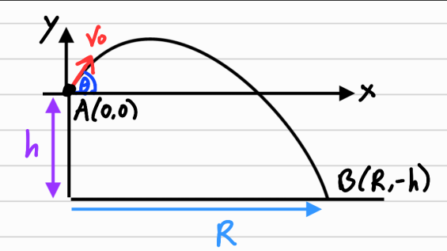

## Motivasi

Bayangkan kamu sedang ikut sebuah perlombaan. Lombanya adalah sebagai berikut: Kamu berada di gedung dengan tinggi h. Sebuah mesin digungakan untuk melemepar sebuah batu dengan kecepatan $v_0$ agar kecepatan batu dari setiap peserta sama semua. Tantangannya adalah kamu perlu mengatur sudut mesin tersebut agar bisa melemparkan batu yang paling jauh. Berapakah sudut tersebut dan berapakah jarak terjauh yang dapat dicapai?

## Mencari Waktu Penerbangan

Perhatikan bahwa kita ingin melempar batu dari ketinggian h dengan kecepatan $v_0$. Misalkan sudut mesin tersebut adalah $\theta$. Mari kita lihat diagramnya.

Dapat dilihat bahwa kita bisa menggunakan persamaan gerak lurus berubah beraturan sebagai berikut:

$$- h = - \frac{g t^{2}}{2} + t v_0 \sin{\left(\theta \right)}$$

Kemudian, kita bisa mencari t dari persamaan ini. Perhatikan bahwa t adalah persamaan kuardrat jadi dapat memiliki 2 solusi. Ingat bahwa kita hanya menginginkan t yang bernilai positif.

$$t=\frac{v_0 \sin{\left(\theta \right)} + \sqrt{2 g h + v_0^{2} \sin^{2}{\left(\theta \right)}}}{g}$$

## Persamaan Jarak pada sumbu x

Kemudian perhatikan bahwa $R=v_0\cdot \cos(\theta)\cdot t$. Kita bisa langsung subtitusi dan mendapatkan R nya.

$$R=v_0\cos(\theta)\cdot\frac{v_0 \sin{\left(\theta \right)} + \sqrt{2 g h + v_0^{2} \sin^{2}{\left(\theta \right)}}}{g}$$

## Memaksimalkan Jarak

Kita ingin membuat R maksimal dari segala kemungkinan $\theta$ yang ada pada kuardran 1. Perhatikan bahwa ini adalah persamaan optimisasi. Kita bisa langsung menurunkannya kemudian membuatnya = 0.

Pertama, mari kita menurunkan R terhadap $\theta$:

$$\frac{dR}{d\theta}=- \frac{v_0 \left(v_0 \sin{\left(\theta \right)} + \sqrt{2 g h + v_0^{2} \sin^{2}{\left(\theta \right)}}\right) \sin{\left(\theta \right)}}{g} + \frac{v_0 \left(\frac{v_0^{2} \sin{\left(\theta \right)} \cos{\left(\theta \right)}}{\sqrt{2 g h + v_0^{2} \sin^{2}{\left(\theta \right)}}} + v_0 \cos{\left(\theta \right)}\right) \cos{\left(\theta \right)}}{g}$$

Kemudian, mari kita sederhanakan dan membuat $\frac{dR}{d\theta} = 0$

$$\frac{v_0 \left(v_0 \sin{\left(\theta \right)} + \sqrt{2 g h + v_0^{2} \sin^{2}{\left(\theta \right)}}\right) \left(v_0 \cos^{2}{\left(\theta \right)} - \sqrt{2 g h + v_0^{2} \sin^{2}{\left(\theta \right)}} \sin{\left(\theta \right)}\right)}{g \sqrt{2 g h + v_0^{2} \sin^{2}{\left(\theta \right)}}} = 0$$

Terakhir, mari kita cari $\theta$ yang akan memaksimalkan R.

$$\theta=2 \operatorname{atan}{\left(\frac{\sqrt{4 g h + 3 v_0^{2} - 2 \sqrt{2} \sqrt{g h + v_0^{2}} \sqrt{2 g h + v_0^{2}}}}{v_0} \right)}$$

Itulah sudut yang akan memaksimalkan jarak lemparan. 

## Mencari jarak maksimal

Setelah mendapatkan jarak optimal, kita bisa langsung mensubstitusikannya ke persamaan R.

$$
\begin{align*}
R&=v_0\cos(\theta)\frac{v_0 \sin{\left(\theta \right)} + \sqrt{2 g h + v_0^{2} \sin^{2}{\left(\theta \right)}}}{g} \\
&=\frac{v_0 \left(v_0 \sin{\left(2 \operatorname{atan}{\left(\frac{\sqrt{4 g h + 3 v_0^{2} - 2 \sqrt{2} \sqrt{g h + v_0^{2}} \sqrt{2 g h + v_0^{2}}}}{v_0} \right)} \right)} + \sqrt{2 g h + v_0^{2} \sin^{2}{\left(2 \operatorname{atan}{\left(\frac{\sqrt{4 g h + 3 v_0^{2} - 2 \sqrt{2} \sqrt{g h + v_0^{2}} \sqrt{2 g h + v_0^{2}}}}{v_0} \right)} \right)}}\right) \cos{\left(2 \operatorname{atan}{\left(\frac{\sqrt{4 g h + 3 v_0^{2} - 2 \sqrt{2} \sqrt{g h + v_0^{2}} \sqrt{2 g h + v_0^{2}}}}{v_0} \right)} \right)}}{g} \\
\end{align*}
$$

Mari kita hilangkan suku trigonometrinya, Lalu kita dapatkan R maksimum adalah:

$$R=\frac{v_0 \left(\frac{v_0^{2} \sqrt{4 g h + 3 v_0^{2} - 2 \sqrt{2} \sqrt{g h + v_0^{2}} \sqrt{2 g h + v_0^{2}}}}{2 g h + 2 v_0^{2} - \sqrt{2} \sqrt{g h + v_0^{2}} \sqrt{2 g h + v_0^{2}}} + \sqrt{2 g h + \frac{v_0^{4} \cdot \left(4 g h + 3 v_0^{2} - 2 \sqrt{2} \sqrt{g h + v_0^{2}} \sqrt{2 g h + v_0^{2}}\right)}{\left(2 g h + 2 v_0^{2} - \sqrt{2} \sqrt{g h + v_0^{2}} \sqrt{2 g h + v_0^{2}}\right)^{2}}}\right) \left(- 2 g h - v_0^{2} + \sqrt{4 g^{2} h^{2} + 6 g h v_0^{2} + 2 v_0^{4}}\right)}{g \left(2 g h + 2 v_0^{2} - \sqrt{2} \sqrt{g h + v_0^{2}} \sqrt{2 g h + v_0^{2}}\right)}$$

## Apakah Jawabannya Masuk Akal?

Mari kita coba memasukkan beberapa _initial condition_.

Untuk h=15, $v_0$=15, dan g=9.8, didapatkan R=34.8697522955955

Untuk h=10, $v_0$=10, dan g=9.8, didapatkan R=17.5557658511074

Untuk h=10, $v_0$=10, dan g=1.8, didapatkan R=64.78835438717

Jawabannya sudah cukup masuk akal bukan? :D

## Final Thoughts

Soal ini sebenarnya adalah soal yang cukup mudah untuk dikerjakan oleh anak SMA. Semua konsep yang dipelajari telah di pelajari di jenjang SMA. Tetapi karena ini adalah masalah optimisasi yang memerlukan turunan, dan fungsinya cukup _ribet_, saya menggunakan _package python_ untuk menurunkan dan untuk mencari nilai sudut. Selain itu untuk menghilangkan suku trigonometri, _package python_ juga sangat menguntungkan. Package yang saya gunakan adalah _sympy_. 

Oh iya, saya juga berterima kasih kepada seseorang di komunitas discord yaitu `Haruto13` yang telah mengkoreksi saya dalam mencari waktu yang dibutuhkan batu untuk terbang tersebut. Big thanks to him! Terima kasih juga kepada beliau yang sudah membuat _free body diagram_ untuk blog ini.

Itu saja dari saya untuk blog ini, semoga menambah wawasan Anda :D